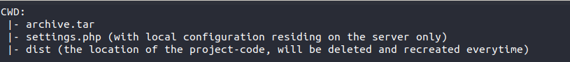

#General

These scripts are ment to be run in a context of CI/CD, \
so they are not ment for running inside an actual environment serving content.

We found it best to just replicate the folder-structure of our website\
in a separate folder and have a dedicated user take care of this.

If you followed some of our [blog-posts](https://www.1xinternet.de/blog) you will have\
noticed that we are committing our settings.php to our repository and\
require environment-specific configurations at runtime(e.g. definitions for the DB-Connection).

This environment-specific file needs to be present as well\
to actually get the "site" into a working state.\
All else that is required is a working DB.\
files and private will not be required for this setup.

This is what the folder-structure looks like\

The update-scripts need to be executed inside of CWD .

We assume that certain things are just "there".\
Like the Database-Dump to be used or the artifact to be deployed as\
these things are more concerned with setting up the environment and\
not the automated security-update.

Furthermore dist is a folder and unlike a more elaborate setup, not a symlink to an artifact.\
Because we do not need to keep previous artifacts at the ready.

Sometimes the scripts might not be fitting your setup.\
As an example you are using [Jenkins](https://jenkins.io/) but forwarding your key globally\
to actually do a `git push` on the remote is out of the question.

In such a case it is best to put the `git push` into a separate job and explicitly call 
`ssh -oForwardAgent=yes.....`.\
We didn't encounter any such problems with [Gitlab](https://about.gitlab.com/) as it works differently.

* [D8-Security-Updates](D8/securityUpdate.sh)
* [D7-Security-Updates](D7/securityUpdate.sh)